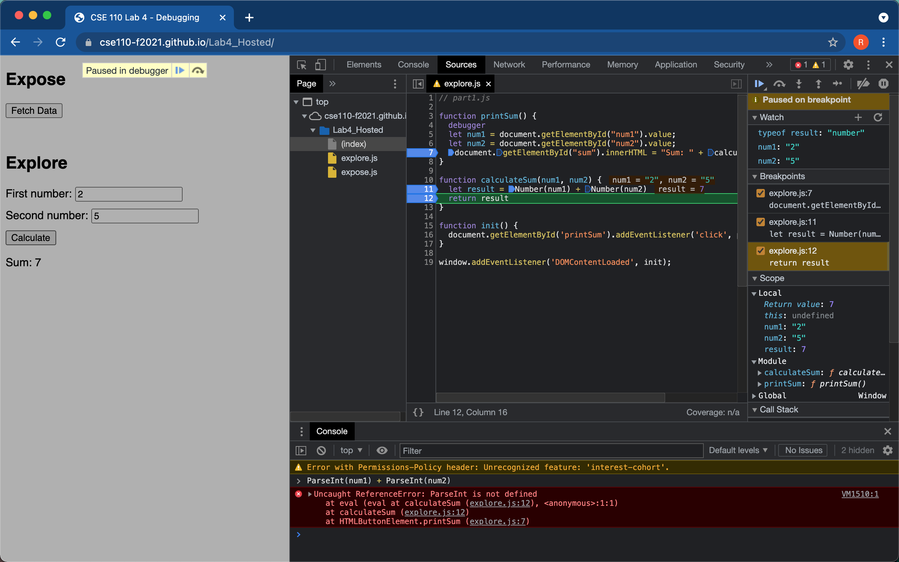

### Explore-DevTools-Debugging

1. The bug was that the dataType of the variable result is string. This is because the num1 and num2 variables are of the type string and when we performing the addition we are actually concatenating two of them. For example, "2" + "5" is giving is 25. This is the bug.
2. In order to fix this we can either use result = parseInt(num1) + parseInt(num2) or result = Number(num1) + Number(num2) when we are initializing the local variable result in the function calculateSum. 

